# Programação Reativa
Nesse resumo, apresentarei algumas definições para programação reativa, citando o próprio Manifesto Reativo, buscando remover algumas das principais dúvidas que percorrem esse campo do desenvolvimento. Além disso, ao fim, apresentarei alguns exemplos a fim de fixar essas ideias iniciais em torno do desenvovolviemto reativo. 

## O que é programação reativa?
É um modelo ou paradigma de programação orientado no fluxo de dados e propagação de mudanças. Assim, é possível expressar (notificar) dinamicamente fluxos de dados através de linguagens de programação, sendo fundamental, nesse sentido, a automática notificação (propagação) de mudanças.

Em termos práticos, um fluxo de dados na programação reativa será propagada para os demais componentes de maneira estrutural.

Para ser, então, reativo o software precisa ser Responsivo, Resiliente, Elástico e ser Guiado por mensageria.                                       

# Hands-on!
Todos os conceitos serão apresentados com base na diferenciação de dois recursos importantes do RxJS: Promisses, Observables e tipos especiais de Observables.

# Promisse:
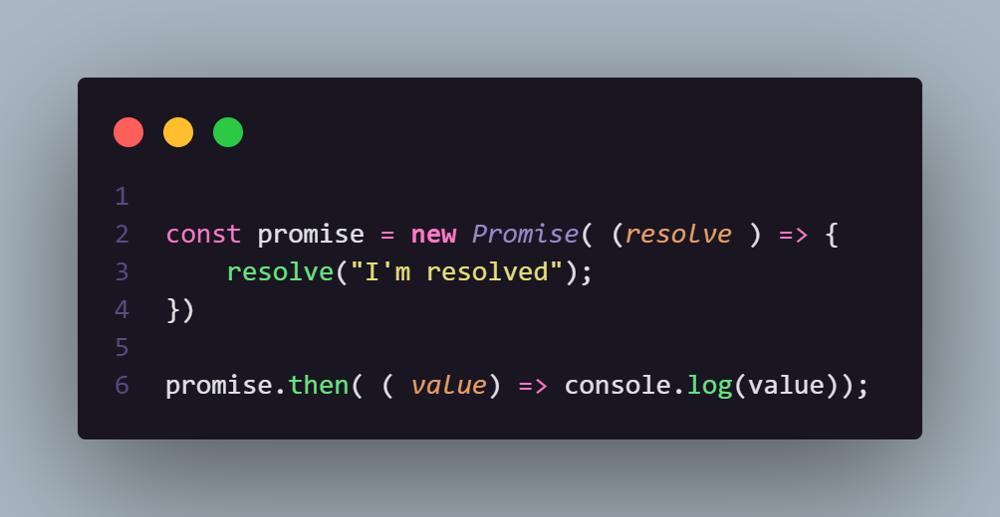
Na promise, o dado é lançado no momento em que a ela é resolvida e, então, se recepcionada (e não for rejeitada), no momento em que o .then() é acionada, o valor da promise é passado. Seguindo esse fluxo:

 

Resultado do código acima no console:

### Observable:
Para os observables, o dado é lançado e recepcionado da seguinte maneira:
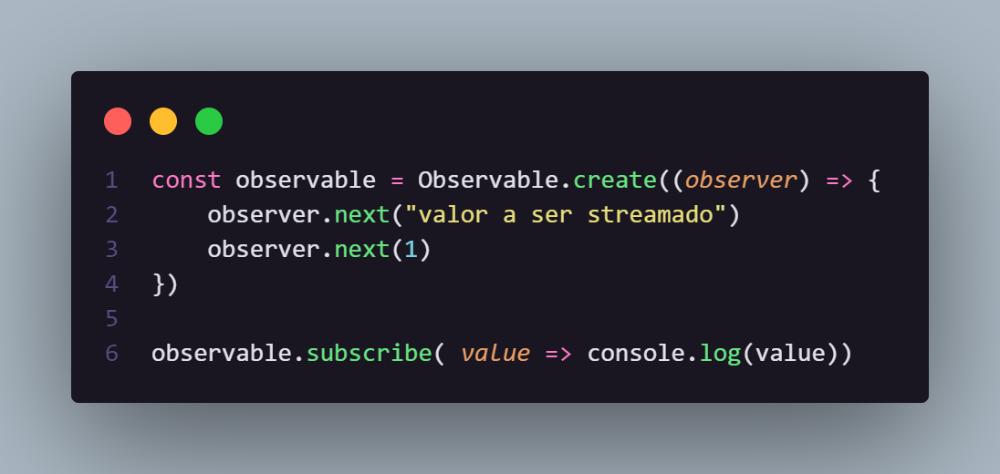

Resultado no console:

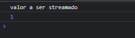 

> 💡 **Tip:** Perceba que os observables podem lançar mais de um tipo de dado, já nas promises, só se resolve (lança algum dado) uma única vez.

# Compartilhamento de estado
A promisse possui estado compartilhado com suas 'inscrições', já o Observable não. Isto é, sempre que um '.then'é chamado de uma promisse, todo o mesmo resultado é resolvido; já para os observables, sempre que há um '.subscribe' em um observável, todo o bloco é reexecutado (desde a emissão, até a recepção do dado).

# Cancelamento

| Promisse      | Observable  |
| ----------- | ----------- |
| assíncrono    |  síncrono ou assíncrono |

O cancelamento de promise só pode ser feito com o uso de algiumas bibliotecas. Mas, nativamente, o observable, possui este comportamento para o cancelamento: 

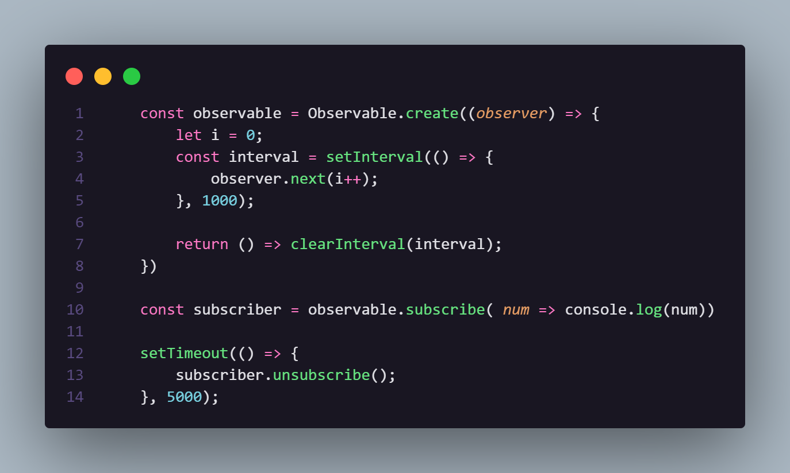 

Nesse caso, se não houvesse o cancelamento através do unsubscribe(), os avlores seriam enviados infinitamente, mas, após 5 segundos, o observable é cancelado e, portanto, o envio é pausado. Veja:

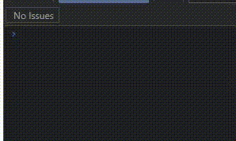

# Subjects e Subscriptions
  
Subscriptions são objetos de uso descartável que representam os recursos de uma subscrição. Isto é, é o objeto que armazena o que foi retornado em um *obsever.subscribe()*:

Com isso, com esse objeto retornado, é possível se desinscrever com base nesse objeto de uma *subscription*. Como visto acina, no tópico de CANCELAMENTO.

Já os Subjects, são tipos especiais de *Observable*, onde multivalores são transmitidos para multiplos observadores. Enquanto os *Observables* são unicast (cada subiscrito tem seu proóprio observer), os subjects são multicast. Perceba:

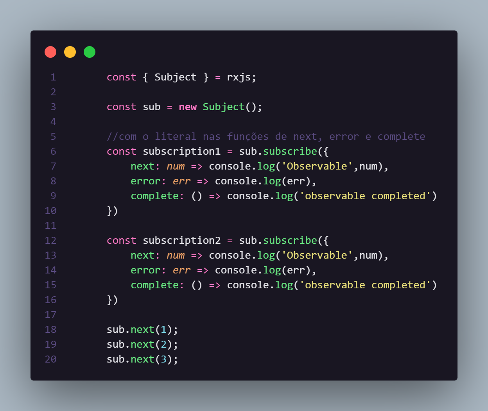

Nesse caso, apenas um subject pode ser subscrito por mais de um observer.

Resultado no console: 

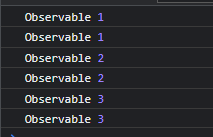

# BehaviorSubject 

É um tipo especial de Subject, onde é necessário um valor inicial e sempre que um novo inscrito é adicionado, o último valor é emitido. Veja:

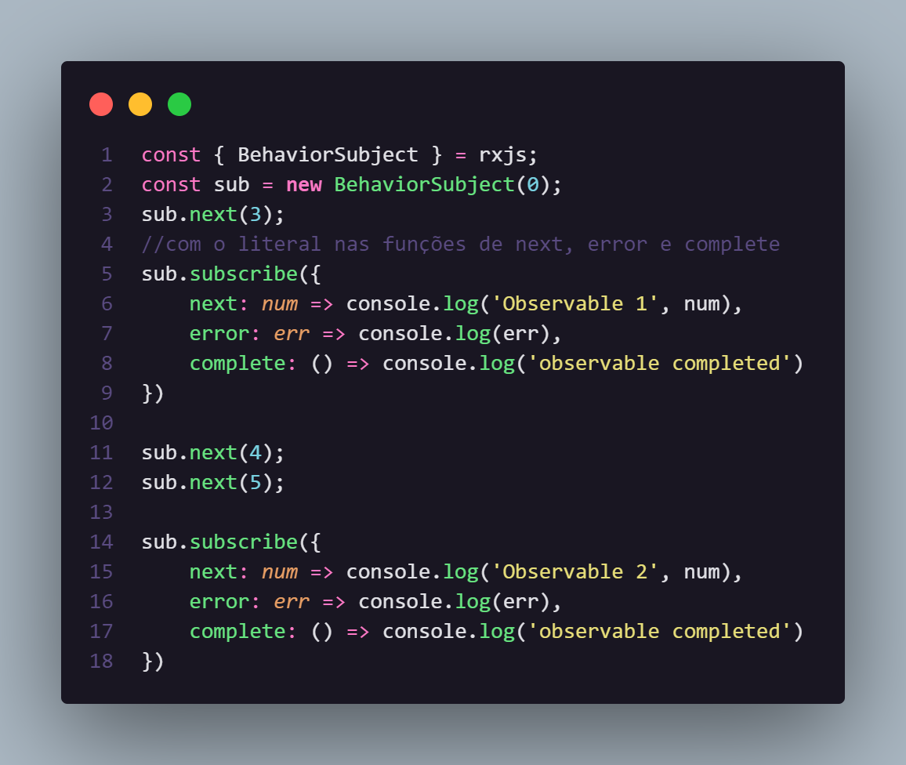

Para o **Observable 2**, apenas o valor 5 foi emitido, pois ele o BehaviorSubject mantém o estado do último valor a cada nova subscrição. Veja:

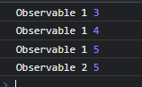

# ReplaySubject

Reemite valores antigos para novos subscritos:

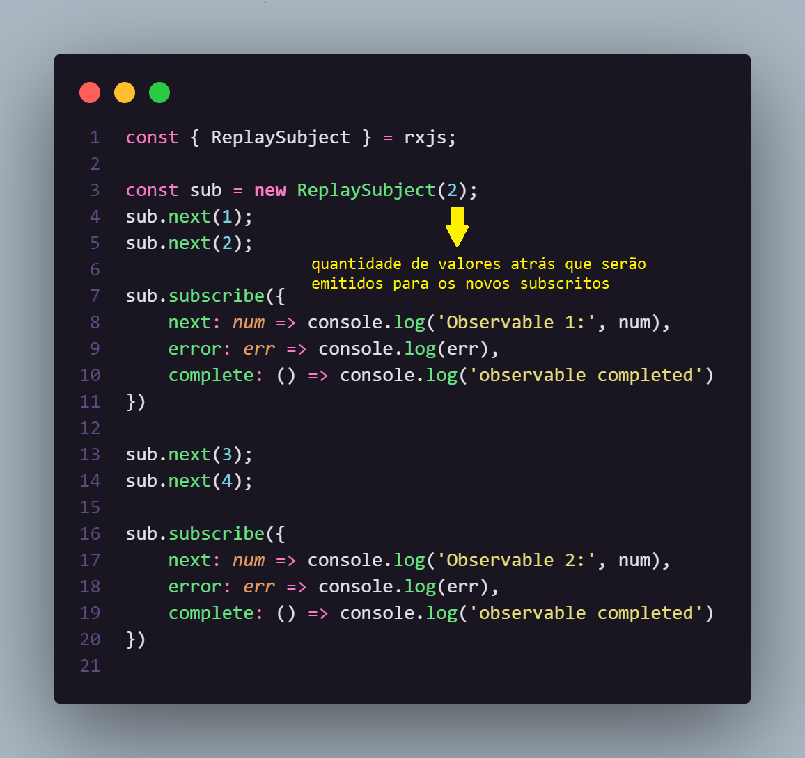

Perceba que o novo subscrito, o ***Observable 2***, 
recebeu os dois ultimos valores (3 e 4).

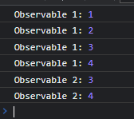

# AsyncSubjects

Apenas emite um valor quando o subject é completado. Se isso acontece, então, o último valor lançado é emitido.

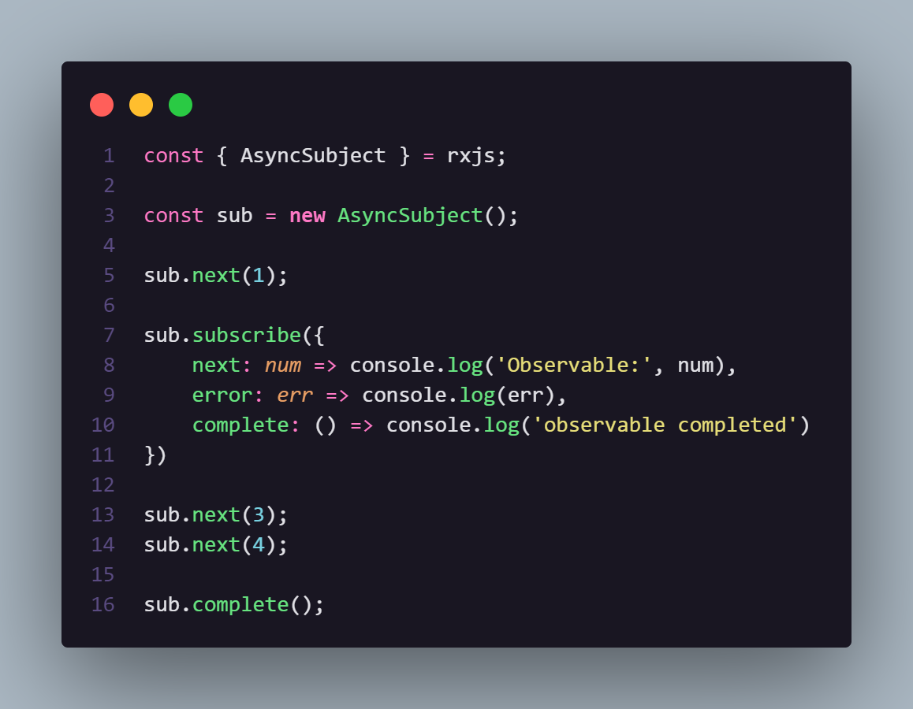

Perceba que, para esse caso, o valor 4 é lançado. Veja:

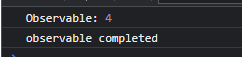

# Operadores

Operadores, em sua estrutura, são funções que produzem comportamentos diferentes aos origiais dos observables, sem, no entanto, modificálos. Eles podem ser classificados entre operadores ***Pipeable*** e ***Creation***.

Nesse sentido, **Pipeable Operators** são modificadores do comportamento ou valores originais de um observable, retornando um novo observable com essas modificações. Isso representa, ainda o principal conceito de um operador, já que o primeiro Observable não foi modificado.
Os casos mais conhecidos são *filter(...), and mergeMap(...)*.

Já os ***Creation Operators***, outro tipo de operador,  

### Referências bibliográficas  
-  [Real Time Programming: Special Purpose or General Purpose Languages [1989]](https://www-sop.inria.fr/members/Gerard.Berry/Papers/Berry-IFIP-89.pdf)
-  [5 Things to Know About Reactive Programming](https://developers.redhat.com/blog/2017/06/30/5-things-to-know-about-reactive-programming#:~:text=Reactive%20programming%20is%20simply%20to,in%20a%20sequence%20over%20time)
-  [The Reactive Manifesto](https://www.reactivemanifesto.org/)
-  [What is Reactive Programming](https://medium.com/@kevalpatel2106/what-is-reactive-programming-da37c1611382)
  
- [Observable - ReactiveX](https://reactivex.io/documentation/observable.html)
  
- [JWDev Treinamentos - Tudo sobre RxJS](https://www.youtube.com/watch?v=hrSYyr2sUac&list=PLJYZJYNervmPUrNb-mHh7ct8c21R8nWqn)
  
- [Programação Reativa // Dicionário do Programador](https://youtu.be/OssqXGdmbAE)

- [Subscription](https://rxjs.dev/guide/subscription)

- [Subject](https://rxjs.dev/guide/subject)
  
- [BehaviorSubject](https://www.learnrxjs.io/learn-rxjs/subjects/behaviorsubject)

- [ReplaySubject](https://www.learnrxjs.io/learn-rxjs/subjects/replaysubject)

- [ReplaySubject](https://www.learnrxjs.io/learn-rxjs/subjects/replaysubject)